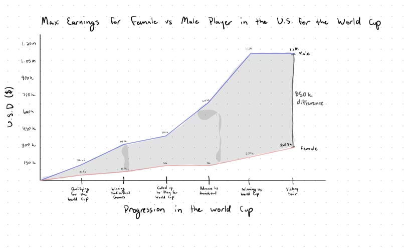

| [home page](README.md) | [data viz examples](dataviz-examples.md) | [critique by design](critique-by-design.md) | [final project I](final-project-part-one.md) | [final project II](final-project-part-two.md) | [final project III](final-project-part-three.md) |

# Makeover Monday Redesign
_For each step below, you should document your progress as you move forward.  In terms of tone, think of the writeup as though you're keeping journal of your step-by-step process.   You should include a any insights you gained from the critique method, and what it led you to think about when considering the redesign.  You should talk about how you moved next to the sketches, and any insights you gleaned from your user feedback.  Document what you changed based on the user feedback in your redesign.  Finally, talk about what your redesigned data visualization shows, why you selected the data visualization you did, and what you attempted to show or do differently._

_You can include screenshots, sketches or other artifacts with your narrative to help tell the story of how you moved through the process.  Again, make sure to avoid including any personally identifying information about your interviewees (don't list full names, etc.).  While this template serves as a guide, make sure to reference the assignment writeup on Canvas for the official guidance.  This template does not include all guidance mentioned on the assignment page._

## Step one: the visualization

_Include link to the original data visualization (or screenshot - make sure to correctly cite your sources, etc.).  Include paragraph or two on why you selected this particular data visualization.  For obvious reasons, the data visualization you select should come from a publicly accessible source._

I chose the visualization called "The Gender Pay Gap in US World Cup Bonuses". The article was posted by the Guardian on June 28, 2019. [Article Link](https://www.theguardian.com/football/ng-interactive/2019/jun/28/revealed-the-731003-gender-pay-gap-in-us-world-cup-bonuses)

I really liked the progression of the original visualization, how the bubbles would enlarge based on the bonus amount, but I felt like it could've done a better job of highlighting how large the pay gap actually is. I also really care about the wage gap topic. As I woman, I try to ensure that the companies I work for don't have a wage gap based on gender. 

## Step two: the critique
_Don't forget to complete the Google Form found on the assignment page.  You can summarize your thoughts here._

Overall observations:
The visualization is very easy to understand. I like how they broke up each progression in the World Cup and had both the total and incremental bonuses for each stage. I liked that the reader can see the bubbles increasing unproportionally, but it's hard to gauge how big each bubble is. For the last stage, the $1.1M bubble doesn't look as astronomically larger than the 260K bubble than what I think it should be. It's also hard to gauge how the bonus gap adds up over time. I think this will look better as a line graph. I enjoyed the descriptions and information for each step. If I combine all of this into one visualization, I think it'll be hard to include the extra information. I would shift the focus on the bonuses at each stage to the total wage gap overall. Color-wise, I understand that they may have not wanted to use the "stereotypical" pink and blue to represent females and males but it's confusing to use blue for females since it normally represents males. 

## Step three: Sketch a solution

For my solution, I decided to convert the visualization into a line graph. I charted the total max salary for females vs males over the progression of the World Cup. 

I changed to color to blue and pink to easily represent males and females without reading the labels. I also decided to highlight the large gap at the end. In the line graph, the gap is much larger than what it seemed like in the original visualization. 

## Step four: Test the solution

_Before you conduct your interviews, prepare a simple script.  Use this as a guide and as a way to take notes as you go forward. Come up with your own list of questions you want to ask for the selected visualization. Keep the questions broad so you can get the most value out of your feedback. Then, document answers to your questions here._

I decided to use the sample questions provided because it was representative of the information I was trying to gain. I also felt like my visualization was simple enough to where further questions were not needed. 

Questions asked: 

1. Can you tell me what you think this is?

2. Can you describe to me what this is telling you?

3. Is there anything you find surprising or confusing?

4. Who do you think is the intended audience for this?

5. Is there anything you would change or do differently?

Testers:
* MISM, 21
* MISM, 22
* MAM, >28

Results: 

*  Can you tell me what you think this is?
- Its max earnings for female vs male player in the US for the world cup
- This visualization shows the max earnings for female vs male players in the U.S. for the world cup
- The max earnings for female vs male players in the World Cup
* Can you describe to me what this is telling you?
- Men are making more money in world cup than women
- It is telling me that there is a large difference between male and female earnings and males are earning way more than females
- There's a large wage gap between the males and females
* Is there anything you find surprising or confusing?
- They are making so much more than women
- I find the difference between male and female earnings very surprising
- Nothing is confusing. The difference is surprising
* Who do you think is the intended audience for this?
- Sexism study/researchers
- Sports analysts, important decision makers in sports
- Those interested in the World Cup in the US
* Is there anything you would change or do differently?
- The line graph is a bit confusing to me → would do a bar graph instead
- I would make the numbers and labels on the axes bigger because they are kind of hard to see
- Maybe add some information about what each bonus means

Synthesis: 

_What patterns in the feedback emerge?  What did you learn from the feedback?  Based on this feedback, come up with what design changes you think might make the most sense in your final redesign._

Everyone was able to get the message that there's a large pay gap between the males and the females and were surprised by it. I was initially surprised that someone thought the data would've been better represented as a bar graph. But that makes sense since the "timeline" is more categorical than an actual timeline. I decided to stick with the line graph though because I felt like it would display the gap better. Additionally, I wouldn't add information about each stage in the World Cup on the visualization itself but I think it would be good to have information on how the bonuses work outside of the visualization. There could be descriptions after the visualization is shown that provides more background information. 

## Step five: build the solution

_Include and describe your final solution here. It's also a good idea to summarize your thoughts on the process overall. When you're done with the assignment, this page should all the items mentioned in the assignment page on Canvas(a link or screenshot of the original data visualization, documentation explaining your process, a summary of your wireframes and user feedback, your final, redesigned data visualization, etc.)._

<noscript></noscript><object class='tableauViz'  style='display:none;'><param name='host_url' value='https%3A%2F%2Fpublic.tableau.com%2F' /> <param name='embed_code_version' value='3' /> <param name='site_root' value='' /><param name='name' value='MakeoverMonday_17393961334560&#47;Sheet1' /><param name='tabs' value='no' /><param name='toolbar' value='yes' /><param name='static_image' value='https:&#47;&#47;public.tableau.com&#47;static&#47;images&#47;Ma&#47;MakeoverMonday_17393961334560&#47;Sheet1&#47;1.png' /> <param name='animate_transition' value='yes' /><param name='display_static_image' value='yes' /><param name='display_spinner' value='yes' /><param name='display_overlay' value='yes' /><param name='display_count' value='yes' /><param name='language' value='en-US' /><param name='filter' value='publish=yes' /></object>
                

There were some limitations on Tableau to create the visualization I wanted. I tried having the area between the lines to be shaded in a light gray. I was able to get close by having a dual axis with two graphs, one with lines and one with areas. But I was not able to change the color of the area without changing the color of the lines themselves. I also wasn't able to delete the area under the women's curve. I also wanted a line connecting the ending sum to highlight the difference but that also wasn't possible on Tableau. I was able to add a horizontal average line but not a vertical line. Lastly, I wasn't able to add a horizontal axis title, probably because it's technically not a line graph because there aren't any dates. So I edited the title to make it more clear that each section is a progression through the World Cup.

I do think that the visualization still does a good job of getting the message across. It just doesn't have the extra elements that I wanted. 

## References
_List any references you used here._

## AI acknowledgements
_If you used AI to help you complete this assignment (within the parameters of the instruction and course guidelines), detail your use of AI for this assignment here._

I did not use AI to complete this assignment. 
