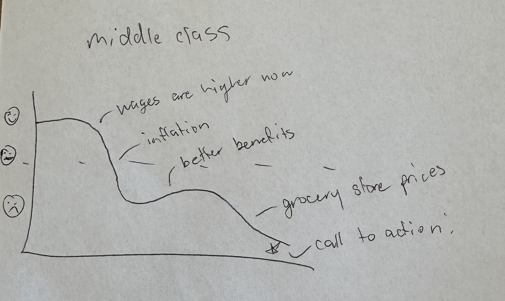
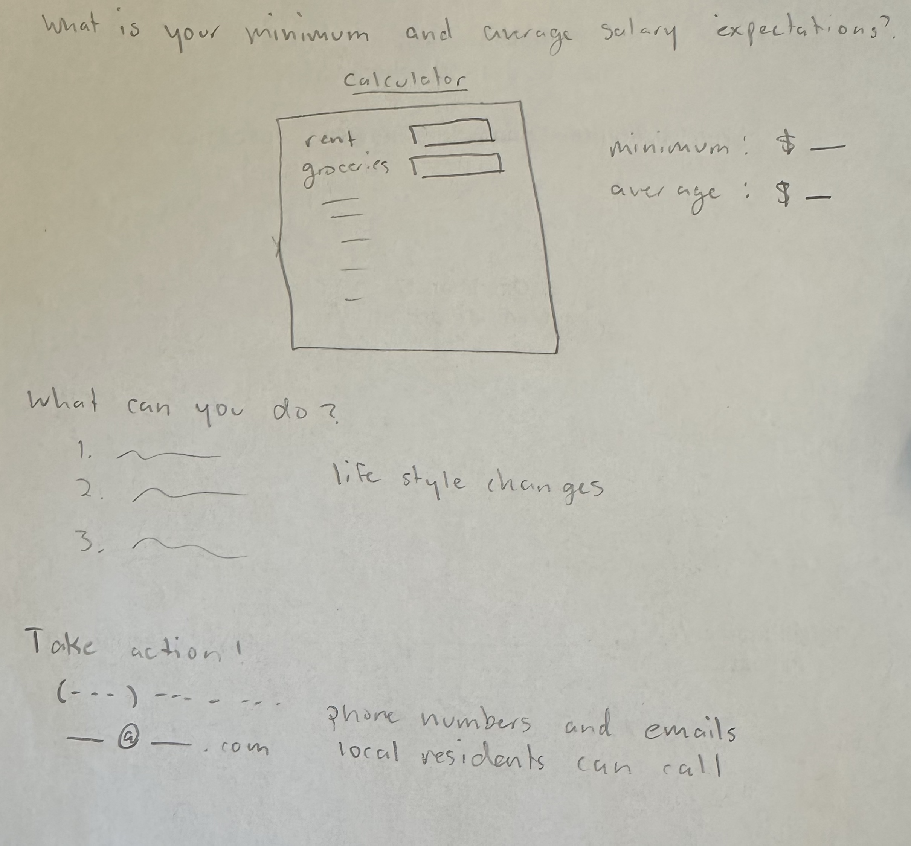

| [home page](README.md) | [data viz examples](dataviz-examples.md) | [critique by design](critique-by-design.md) | [final project I](final-project-part-one.md) | [final project II](final-project-part-two.md) | [final project III](final-project-part-three.md) |

> Important note: this template includes major elements of Part I, but the instructions on Canvas are the authoritative source.  Make sure to read through the assignment page and review the rubric to confirm you have everything you need before submitting.  When done, delete these instructions before submitting.

# Outline
> Include a high-level summary of your project.  This should be a couple paragraphs that describe what you're interested in showing with your final project. 
 
I will start by showing the average salary of Pittsburgh residents over time. Then I will show the same graph but adjusted for inflation. After being adjusted, the graph should look more grim to emphasize that people’s salaries are not where they should be. To add to that point, I will compare the salary of a fresh college graduate in 19– compared to 2024 also adjusted for inflation. 
I will go into a more positive route where I'll show that we do have a better quality of life since then. LIfe expectancy has gone up, better job benefits, better healthcare. But then I'll counter with the costs of all of these benefits. The cost of healthcare now, the cost of groceries, rent, etc. 

Using the data for current estimates of a person’s monthly expenses, I'll create a model that estimates what a person’s minimum salary should be and what their average salary should be. This model can be applied to other cities. I’ll use this as a call to action to have the reader understand what base salaries they should be going for, and if that isn’t achievable, I'll list out steps they can take to alter their lifestyle in order to better utilize their salary. 

> A project structure that outlines the major elements of your story.  Your Good Charts text talks about story structure in Chapter 8 - you should describe what you hope to achieve.  Make sure the outline is detailed enough that we can see how you anticipate your story unfolding.  You can incorporate your Story Arc from the in-class exercise along with your user stories and one sentence summary to make the topic even more clear. 

## Initial sketches
> Post images of your anticipated data visualizations (sketches are fine). They should mimic aspects of your outline, and include elements of your story.  

 
 
 

# The data
> A couple of paragraphs that document your data source(s), and an explanation of how you plan on using your data. 

I have found a couple datasets for each category I plan on showing data on. The census page has links to many datasets collected from the most recent census. Useful datasets include median gross rent, median household income, and demographic information. The datausa page is a dashboard that has population, economic, and housing information on multiple cities in the U.S. On the dashboard, there already are multiple data visualizations that I can get the datasets for. There are multiple statista graphs and datasets containing information about salaries and inflation over time. Those are useful to see a general trend. I found a few datasets from Allegheny county as well that detail salary data. There are a lot of datasets to look through, and I can hopefully create some great data visualizations from them. The income datasets are great to set the beginning of my story. And the consumer price indexes will be a great end to my story. 

Pittsburgh salary/income data:
[https://catalog.data.gov/dataset/allegheny-county-employee-salaries](https://catalog.data.gov/dataset/allegheny-county-employee-salaries)
[https://data.wprdc.org/dataset/allegheny-county-employee-salaries](https://data.wprdc.org/dataset/allegheny-county-employee-salaries)
[https://statisticalatlas.com/place/Pennsylvania/Pittsburgh/Household-Income](https://statisticalatlas.com/place/Pennsylvania/Pittsburgh/Household-Income) 

Overall salary and inflation data:
[https://www.statista.com/statistics/1351276/wage-growth-vs-inflation-us/](https://www.statista.com/statistics/1351276/wage-growth-vs-inflation-us/) 
[https://www.statista.com/statistics/185369/median-hourly-earnings-of-wage-and-salary-workers/](https://www.statista.com/statistics/185369/median-hourly-earnings-of-wage-and-salary-workers/) 
[https://www.statista.com/statistics/185247/median-weekly-earnings-of-full-time-wage-and-salary-workers/](https://www.statista.com/statistics/185247/median-weekly-earnings-of-full-time-wage-and-salary-workers/) 
[https://www.usinflationcalculator.com/inflation/current-inflation-rates/](https://www.usinflationcalculator.com/inflation/current-inflation-rates/) 
[https://fred.stlouisfed.org/series/T5YIE](https://fred.stlouisfed.org/series/T5YIE) 

Inflation calculator, budget based:
[https://zivahub.uct.ac.za/articles/dataset/Personal_Inflation_Calculator/6882941?file=12742364](https://zivahub.uct.ac.za/articles/dataset/Personal_Inflation_Calculator/6882941?file=12742364) 

Salary dashboards:
[https://www.census.gov/quickfacts/fact/table/pittsburghcitypennsylvania/PST045223](https://www.census.gov/quickfacts/fact/table/pittsburghcitypennsylvania/PST045223) 
[https://datausa.io/profile/geo/pittsburgh-pa/#:~:text=In%202022%2C%20Pittsburgh%2C%20PA%20had,%2460%2C187%2C%20a%2010.8%25%20increase] (https://datausa.io/profile/geo/pittsburgh-pa/#:~:text=In%202022%2C%20Pittsburgh%2C%20PA%20had,%2460%2C187%2C%20a%2010.8%25%20increase) 
[https://www.city-data.com/income/income-Pittsburgh-Pennsylvania.html](https://www.city-data.com/income/income-Pittsburgh-Pennsylvania.html)  

College graduate salary:
[https://www.statista.com/statistics/642041/average-wages-of-us-college-graduates/](https://www.statista.com/statistics/642041/average-wages-of-us-college-graduates/) 
[https://nces.ed.gov/programs/coe/indicator/cba/annual-earnings](https://nces.ed.gov/programs/coe/indicator/cba/annual-earnings) 
[https://www.cnbc.com/2023/09/26/todays-graduates-make-less-than-their-parents-adjusted-for-inflation.html](https://www.cnbc.com/2023/09/26/todays-graduates-make-less-than-their-parents-adjusted-for-inflation.html) 

Rent trends:
[https://www.zillow.com/rental-manager/market-trends/pittsburgh-pa/](https://www.zillow.com/rental-manager/market-trends/pittsburgh-pa/) 
[https://www.rentcafe.com/average-rent-market-trends/us/pa/pittsburgh/](https://www.rentcafe.com/average-rent-market-trends/us/pa/pittsburgh/) 
[https://www.apartments.com/rent-market-trends/pittsburgh-pa/](https://www.apartments.com/rent-market-trends/pittsburgh-pa/) 
[https://www.rent.com/pennsylvania/pittsburgh-apartments/rent-trends](https://www.rent.com/pennsylvania/pittsburgh-apartments/rent-trends) 

Consumer price index:
[https://www.ers.usda.gov/data-products/food-price-outlook](https://www.ers.usda.gov/data-products/food-price-outlook) 
[https://www.bls.gov/regions/mid-atlantic/data/averageretailfoodandenergyprices_usandmidwest_table.htm](https://www.bls.gov/regions/mid-atlantic/data/averageretailfoodandenergyprices_usandmidwest_table.htm) 
[https://fred.stlouisfed.org/series/CUSR0000SAF11](https://fred.stlouisfed.org/series/CUSR0000SAF11)

> A link to the publicly-accessible datasets you plan on using, or a link to a copy of the data you've uploaded to your Github repository, Box account or other publicly-accessible location. Using a datasource that is already publicly accessible is highly encouraged.  If you anticipate using a data source other than something that would be publicly available please talk to me first. 

# Method and medium
> In a few sentences, you should document how you plan on completing your final project. 

I will be using Tableau to create my data visualizations. I might also use javascript or github to try to create a working model that users can input numbers into. 

## References
_List any references you used here._

## AI acknowledgements
_If you used AI to help you complete this assignment (within the parameters of the instruction and course guidelines), detail your use of AI for this assignment here._
I did not use AI for this assignment.
